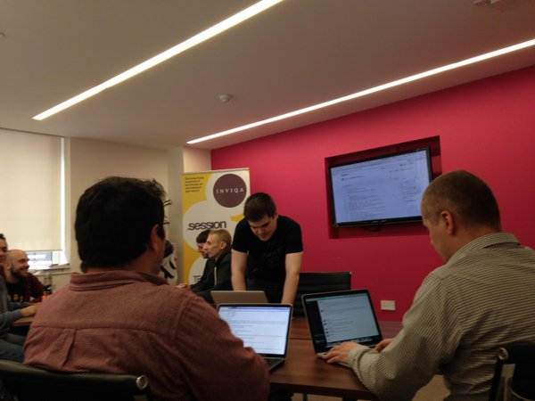

# Stakeholder Whisperer

Although I’ve written software for years, I realised only recently that writing
code was more about communicating with humans than computers. To become a
better engineer, I realised I needed to become a better communicator both
inside and outside the code to create a stronger connection between the code I
write and the people it helps.

As a technical consultant as well as an engineer, I spend as much time working
with business stakeholders and sticky notes as I do with fellow engineers and a
code editor. Bridging both worlds often means I have to find new ways of
communicating ideas and information and ensuring that nothing gets lost in
between. This blog documents my progress at improving communication between the
people caring about software products and the people building them. I hope you
find this blog a useful starting point for thinking about software development
as a talking, rather than writing, activity and would be interested to hear
your thoughts on the subjects discussed here.

## Articles

### [Introducing Modelling by Example](posts/2014/10/introducing-modelling-by-example.md)

For the last year I have been experimenting with the new approach to a
Behaviour-Driven Development, which could be summarised as "Ubiquitous Language
is a thing again". The core premise of this approach is that if you take
Ubiquitous Language seriously and push for it in your scenarios, you open the
door to doing a Domain-Driven Design while you're doing Behaviour-Driven
Development's red-green-refactor cycle. By embedding Ubiquitous Language in
your scenarios, your scenarios naturally become your domain model, which you
can use to develop the most important part of your application - a core domain.
